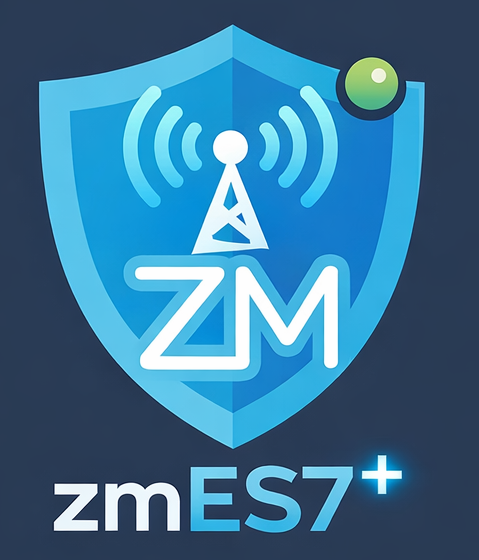

.. Event Server documentation master file, created by
   sphinx-quickstart on Fri Mar 15 08:38:52 2019.
   You can adapt this file completely to your liking, but it should at least
   contain the root `toctree` directive.

Event Notification Server v7+ Documentation
=============================================

.. toctree::
        :hidden:

        guides/breaking
        guides/installation
        guides/principles
        guides/hooks
        guides/config
        guides/es_faq
        guides/hooks_faq
        guides/testing
        guides/developers
        guides/contrib_guidelines

.. toctree::
        :hidden:
        :caption: Related Projects

        pyzmv2+ <https://pyzmv2.readthedocs.io/en/latest/>
        zmNg <https://zmng.readthedocs.io/>

`Github Repository <https://github.com/pliablepixels/zmeventnotification>`__

What is the Event Server and the ML Ecosystem?
++++++++++++++++++++++++++++++++++++++++++++++++

The **Event Notification Server (ES)** is a companion daemon for
`ZoneMinder <https://zoneminder.com>`__. It monitors ZoneMinder's shared
memory for new events and can push real-time notifications to clients via
WebSockets, FCM (push to iOS/Android), and MQTT. It also supports
per-monitor notification rules, time-based muting, and integration with
`zmNinja <https://zmninja.readthedocs.io/en/latest/index.html>`__ and
`zmNg <https://github.com/pliablepixels/zmNg>`__ (the newer-generation
app for ZoneMinder).

The **ML Ecosystem** (``zm_detect.py + pyzm``) is the machine learning detection
framework. They take a ZoneMinder event and run it through one or more
ML pipelines — supporting multiple model types (object, face, ALPR, etc.).
The ML hook is powered by `pyzm <https://pyzmv2.readthedocs.io/en/latest/#>`__,
a standalone ML detection library that can also be used independently.

The ES and the hook can be used together or separately, as described below.

Choose your setup
+++++++++++++++++

There are two ways to use ML-powered object detection with ZoneMinder:

.. topic:: Path 1: Detection only (no ES)

   Wire ``zm_detect.py`` directly to ZoneMinder using ``EventStartCommand``
   (requires ZM 1.38.1+). ZM calls the detection script automatically when
   an event starts. No daemon needed — simpler to set up.
   See :doc:`guides/install_path1` for setup instructions.

.. topic:: Path 2: Full Event Server

   Install and run the Event Notification Server alongside ZoneMinder. The ES
   detects new events via shared memory, invokes the ML hooks, and handles
   push notifications, WebSockets, MQTT, rules, and more.
   See :doc:`guides/install_path2` for setup instructions.

.. include:: guides/_feature_table.rst

If you only need detection results written to your ZM events, Path 1 is simpler to set up.
If you need real-time notifications on your phone or other clients, you need Path 2.

See the :doc:`guides/installation` page for step-by-step setup instructions for either path.

Documentation
+++++++++++++

:doc:`guides/installation`
        How to install the hooks and/or the Event Server (Path 1 and Path 2)
:doc:`guides/hooks`
        How machine learning detection works, configuration reference
:doc:`guides/principles`
        How detection and notifications work (Path 1 and Path 2)
:doc:`guides/config`
        How to use config files
:doc:`guides/breaking`
        Breaking changes. Always read this if you are upgrading.
:doc:`guides/es_faq`
        Event Notification Server FAQ (Path 2)
:doc:`guides/hooks_faq`
        Machine Learning Hooks FAQ
:doc:`guides/testing`
        How to run the unit and e2e test suites
:doc:`guides/developers`
        If you want to use the Event Notification Server to make your own app/client
:doc:`guides/contrib_guidelines`
        If you want to contribute hook scripts to the ES
`pyzmv2+ <https://pyzmv2.readthedocs.io/en/latest/>`__
        Documentation for pyzm, the ML detection library
`zmNinja Documentation <https://zmninja.readthedocs.io/en/latest/index.html>`__
        Documentation for zmNinja
`zmNg <https://zmng.readthedocs.io/>`__
        Documentation for zmNg, the newer-generation app for ZoneMinder

